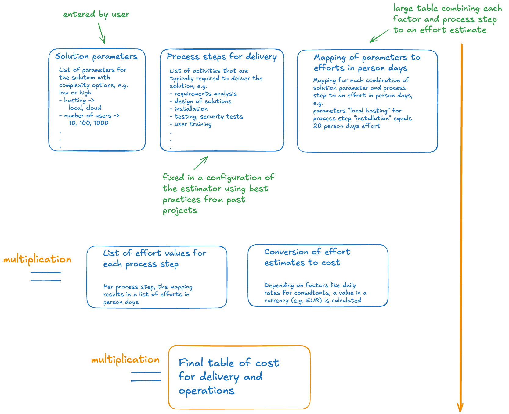

# Disclaimer

This estimator is work in progress. In particular the estimates might not be realistic yet, because the underlying framework is being developed and tested. Handle at your own risk.

# D4D Estimator for digital projects

This repository contains the logic and configuration file for an estimator for digital projects.


# D4D Engine description

The calculation of cost for change and run of the digital solution is depicted in the image below.



# Configuration and tuning of parameters

In order to configure new parameters and the effort factors for the engine, update the file `estimator.json` with respective values.

# Local development

Quick instructions to set up and run the project locally.

Prerequisites:

- Node.js (recommended v16+) and npm installed.

Install dependencies and start the development server:

```bash
npm install
npm start
```

The dev server (Vite) typically runs at `http://localhost:5173` — open that in your browser.

Useful additional commands:

```bash
# Build for production
npm run build

# Preview the production build
npm run preview

# Open Cypress for end-to-end tests
npm run cy:open
```

These are the minimal steps for local development. If you need environment-specific configuration or additional scripts, add them to `package.json` and document them here.